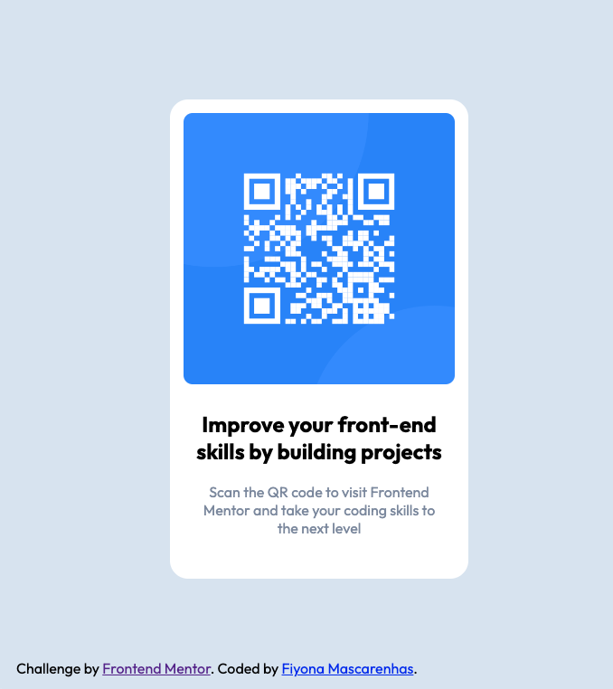

# Frontend Mentor - QR code component solution

This is a solution to the [QR code component challenge on Frontend Mentor](https://www.frontendmentor.io/challenges/qr-code-component-iux_sIO_H). Frontend Mentor challenges help you improve your coding skills by building realistic projects. 

## Table of contents

- [Overview](#overview)
  - [Screenshot](#screenshot)
  - [Links](#links)
- [My process](#my-process)
  - [Built with](#built-with)
  - [What I learned](#what-i-learned)
  - [Continued development](#continued-development)
- [Author](#author)

## Overview

### Screenshot

### Links

- Solution URL: [Solution Githhub Repo](https://github.com/FiyonaM/QR-Code)
- Live Site URL: [Github Live site](https://fiyonam.github.io/QR-Code/)

## My process

### Built with

- Semantic HTML5 markup
- CSS custom properties
- Flexbox
- CSS Grid
- Mobile-first workflow

### What I learned

I practiced the html amd css concepts as it was my first project I created after learning these concepts

### Continued development

I want to continue working on the css layout. 

## Author

- Frontend Mentor - [@FiyonaM](https://www.frontendmentor.io/profile/FiyonaM)

